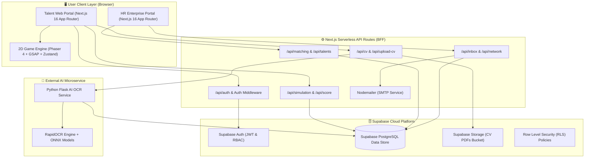
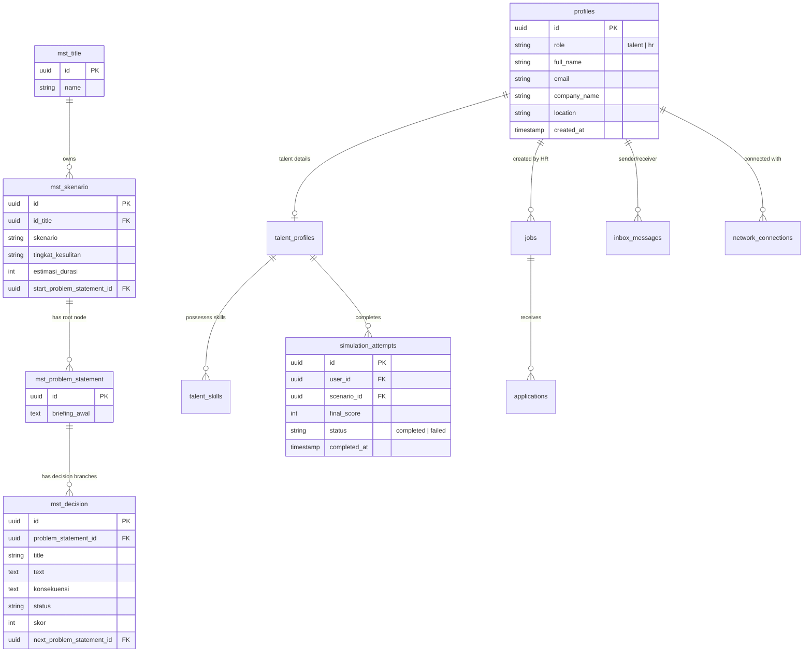
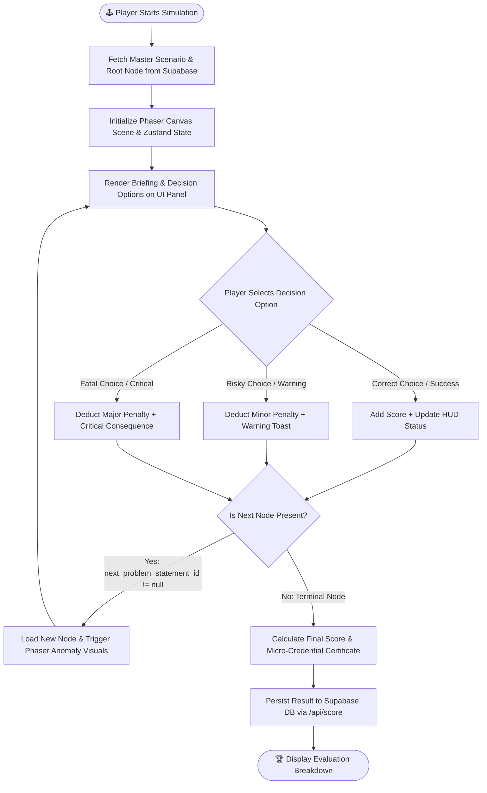
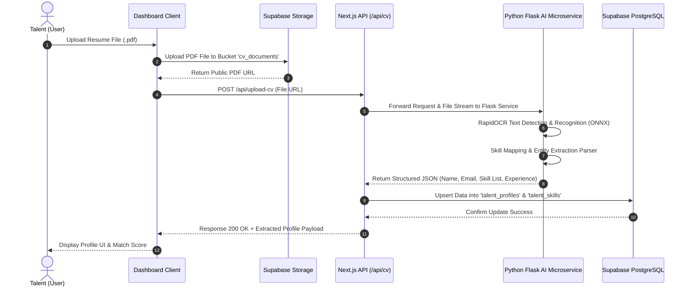

# 🏗️ Architecture Document — Talent Bridge Platform

> **System Architecture Specification for Talent Bridge: Data Center & Tech Talent Ecosystem**  
> *Version 1.0.0 | Last Updated: August 16, 2026*

---

## 📋 1. Executive Summary & Product Vision

**Talent Bridge** is an end-to-end digital ecosystem platform engineered to solve the regional **digital skills gap** in Batam and its surrounding tech corridors, specifically targeting high-demand industries such as **Data Center Operations** and **Cybersecurity Operations Center (SOC)**. The platform connects verified local technical talent with cross-border career opportunities across Singapore and Batam.

### 💡 Core Architectural Pillars:
1. **2D Interactive Simulation Engine (Micro-Credentialing)**: Leverages the Phaser 4 game engine seamlessly integrated with React 19 & Zustand to deliver real-world scenario-based assessments (e.g., *Rack Overheating Crisis* & *SOC Incident Response*) driven by a *Directed Acyclic Graph (DAG)* decision tree.
2. **AI-Powered Automated Resume Parser**: A Python-based OCR pipeline (RapidOCR + ONNX Runtime) that extracts and standardizes unstructured PDF resumes into validated skill profiles.
3. **Talent-Job Match Engine & HR Portal**: Algorithmic matching calculating skill-fit percentages between candidate simulation micro-credentials and active employer job postings (HR recruiters in Singapore and Batam).
4. **Outreach & Direct Messaging Network**: Professional networking hub with direct recruiter-candidate messaging and automated SMTP email notifications powered by Nodemailer.

---

## 🏛️ 2. High-Level System Architecture

The Talent Bridge architecture follows a **Modern Serverless & Microservices Hybrid Pattern**, cleanly decoupling the web frontend/BFF layer, 2D game engine, managed backend/auth infrastructure, and external AI microservice.



---

## 🛠️ 3. Technology Stack Matrix

| System Layer | Technology / Library | Description & Role |
| :--- | :--- | :--- |
| **Frontend Framework** | Next.js 16.3 (App Router), React 19.2 | Server-side rendering, modular App Router, & interactive UI components |
| **Programming Language** | TypeScript 5.x, JavaScript (ESNext) | Strict static typing ensuring safety across frontend code and API routes |
| **Styling & UI** | Tailwind CSS v4, Lucide React, Material Symbols | Modern glassmorphism design system, dynamic themes, & iconography |
| **2D Game Engine** | Phaser 4.2.1, GSAP 3.15 | 2D canvas renderer for server room environments & SOC threat indicators |
| **State Management** | Zustand 5.0 | Reactive state synchronization between Phaser canvas & React UI overlays |
| **Backend & Auth** | Supabase Auth, PostgreSQL 15 | Role-based authentication (Talent vs HR), RLS, & managed database |
| **API & Messaging** | Next.js API Routes, Nodemailer 9.0 | Serverless API endpoints & SMTP email dispatch for recruiter outreach |
| **AI OCR Microservice** | Python 3.10+, Flask, RapidOCR, ONNX Runtime | PDF resume text detection, skill classification, & ONNX inference |

---

## 📦 4. Subsystem Architecture & Directory Structure

The `talent-bridge` directory layout adheres to Next.js App Router conventions:

```
talent-bridge/
├── app/
│   ├── api/                      # Serverless API Endpoints
│   │   ├── cv/                   # CV text extraction endpoint
│   │   ├── inbox/                # HR-Talent messaging endpoint
│   │   ├── jobs/                 # HR job posting management endpoint
│   │   ├── matching/             # Talent-job matching engine endpoint
│   │   ├── network/              # Professional connection network endpoint
│   │   ├── score/                # Talent simulation score update endpoint
│   │   ├── simulation/           # Scenario DAG tree & decision fetch endpoint
│   │   ├── talents/              # Talent pool directory & filter endpoint
│   │   ├── titles/               # Master job role / track endpoint
│   │   └── upload-cv/            # Resume PDF upload endpoint (Supabase Storage)
│   ├── components/               # UI & Game Components
│   │   ├── game/                 # 2D Simulation Engine Components
│   │   │   ├── cyber/            # Phaser SOC scene, Threat Panel, Timeline, Controls
│   │   │   └── dataCenter/       # Phaser Server Room scene, Station Mapping, UI
│   │   ├── hr/                   # HR Enterprise Portal Components
│   │   ├── talent/               # Talent Dashboard & Profile Components
│   │   └── ui/                   # Shared Reusable UI Components
│   ├── dashboard/                # Main Dashboard Layouts & Views
│   │   ├── hr/                   # HR Dashboard (Inbox, Job Manager, Talent Pool)
│   │   └── talent/               # Talent Dashboard (Simulation Hub, Network Hub)
│   ├── services/                 # Business Logic Services (Scenario, Decision, Profile)
│   ├── store/                    # Zustand Reactive Stores (gameStore, cyberFxStore)
│   ├── types/                    # TypeScript interfaces & type definitions
│   ├── globals.css               # Global styling & Tailwind CSS v4 design tokens
│   └── page.tsx                  # Landing Page
├── scripts/
│   └── validate-decision-tree.mjs# CLI utility validating decision tree DAG graph integrity
├── supabase/
│   ├── enable_public_read_rls.sql# Public read-only RLS policy configuration
│   ├── seed_cybersecurity_analyst.sql   # Cybersecurity Analyst scenario seed data
│   └── seed_data_center_technician.sql  # Data Center Technician scenario seed data
└── utils/
    └── supabase/                 # Supabase client helpers (Browser & Server SSR)
```

---

## 🗄️ 5. Database Architecture & Entity Relationship Diagram (ERD)

The Supabase PostgreSQL database separates data into two primary domain domains: **Master Reference Data** (game decision trees) and **User & Operational Data** (profiles, scores, job listings, messages).



---

## 🎮 6. Game & Decision Engine Workflow (DAG Graph)

The simulation engine models decision-making as a **Directed Acyclic Graph (DAG)** where each player choice affects scores (rewards or penalties) and determines branching to subsequent nodes.



### DAG Graph Validation (`scripts/validate-decision-tree.mjs`)
To guarantee production integrity, an automated graph validation tool runs key checks:
- **BFS (Breadth-First Search)**: Verifies that no dead ends exist (nodes without choices) and detects invalid UUID pointers.
- **DFS (Depth-First Search)**: Detects circular dependencies (infinite loops) in decision trees.
- **Orphan Node Detection**: Identifies unlinked database rows unreachable from the scenario entry point.

---

## 🤖 7. AI Resume Parser Pipeline Architecture

CV processing is automated via a deep-learning OCR microservice pipeline to generate verified talent skill profiles.



---

## 🔒 8. Security Architecture & Access Control

1. **Supabase Row Level Security (RLS)**:
   - Reference master tables (`mst_*`) are restricted to `PUBLIC READ` (`SELECT` policy granted to anon/auth users).
   - User tables (`profiles`, `inbox_messages`, `simulation_attempts`) are protected via `auth.uid()` RLS rules, restricting data access strictly to authenticated record owners.
2. **Role-Based Access Control (RBAC)**:
   - `talent` Role: Grants access to interactive simulations, CV parsing, and networking features.
   - `hr` Role: Grants access to the HR Enterprise Portal, job listing creation, talent pool filtering, and direct outreach.
3. **Secrets Protection**:
   - Environment secrets (`SMTP_PASS`, `SUPABASE_SERVICE_ROLE_KEY`) are kept isolated on serverless Next.js API routes and never bundled into client-side JavaScript.

---

## 🚀 9. Deployment & Infrastructure Strategy

- **Frontend & Serverless BFF**: Deployed to **Vercel / Cloud Edge Network** with automated CI/CD integration.
- **Database & Storage**: Hosted on **Supabase Cloud Infrastructure** (Managed PostgreSQL + Supabase Auth + Supabase Storage).
- **AI Microservice**: Containerized Python Flask Application (Docker) deployed on cloud container platforms (AWS ECS / Google Cloud Run / Render) with ONNX Runtime acceleration.

---

*This document serves as the official system architecture specification for the Talent Bridge Platform.*